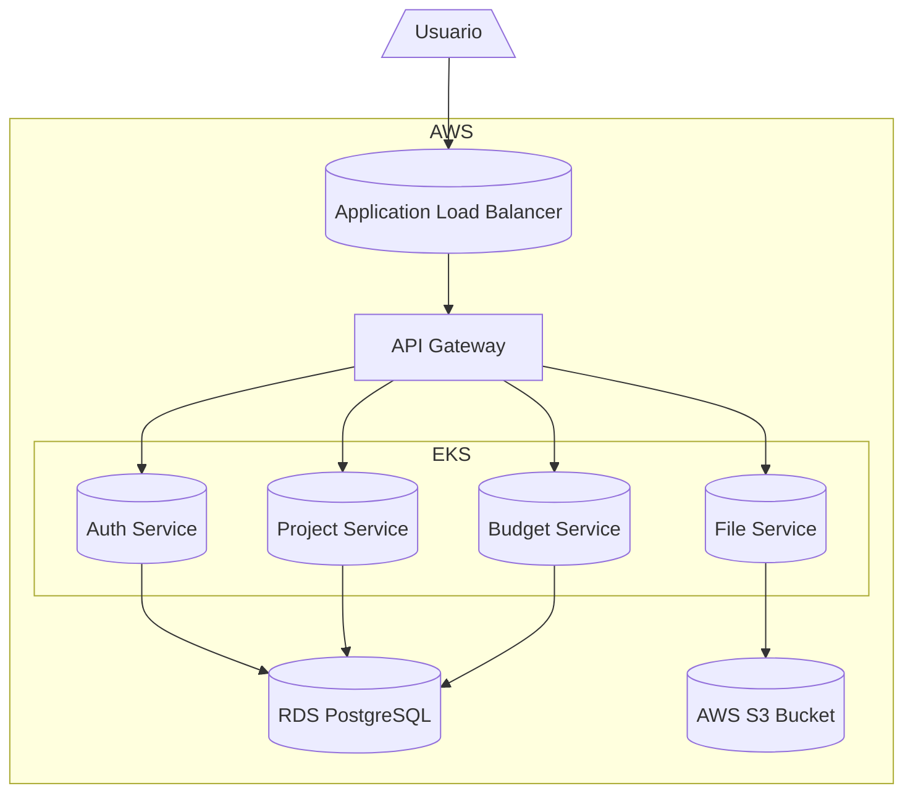

# Informe de Arquitectura Módulo 5 – ProManage

## 1. Introducción

La plataforma ProManage tiene como objetivo ofrecer un sistema de gestión de proyectos completo, que permita a los usuarios registrarse y autenticarse, crear y modificar proyectos, asignar presupuestos, subir y consultar documentos, definir fechas de entrega y gestionar perfiles con distintos niveles de acceso. En este informe presentamos una propuesta arquitectónica basada en microservicios y desplegada en AWS, integrando tecnologías de contenerización y orquestación que aseguren escalabilidad, resiliencia y seguridad.

## 2. Análisis de Requerimientos y Elección de Arquitectura

### 2.1 Identificación de Componentes Clave

- **Frontend (Cliente Web):** SPA desarrollada en React.js que consume APIs para mostrar la interfaz de usuario.
- **API Gateway:** Servicio que unifica y enruta las solicitudes de frontend a los microservicios correspondientes, aplica autenticación y límites de tasa.
- **Auth Service:** Microservicio responsable de registro, login, emisión y validación de JWT.
- **Project Service:** CRUD de proyectos y gestión de metadatos (título, descripción, fechas).
- **Budget Service:** Asigna, actualiza y consulta presupuestos vinculados a cada proyecto.
- **File Service:** Maneja subida, descarga y control de versiones de documentos en AWS S3.
- **Base de Datos Relacional:** PostgreSQL en RDS, para datos transaccionales.
- **Almacenamiento de Objetos:** AWS S3 para archivos y documentos.
- **CI/CD Pipeline:** GitHub Actions para build, test y despliegue automático de imágenes Docker a ECR y Kubernetes.
- **Orquestación:** AWS EKS para gestión de contenedores y despliegues automatizados.

### 2.2 Justificación de la Arquitectura

Optamos por una arquitectura de microservicios para lograr:

- **Escalabilidad Independiente:** Cada componente escala según su carga.
- **Despliegues Desacoplados:** Permite actualizaciones aisladas por servicio, reduciendo riesgo de impacto global.
- **Resiliencia:** Fallos en un servicio no derriban la plataforma.
- **Mantenibilidad y Especialización:** Equipos pequeños pueden enfocarse en un servicio, acelerando el desarrollo.

### 2.3 Selección de Infraestructura (IaaS, PaaS, BaaS)

- **IaaS:** AWS EKS para control granular de nodos y configuración de clúster Kubernetes.
- **PaaS:** AWS RDS para PostgreSQL; ofrece backups automáticos, patching y escalado sin gestionar infraestructura.
- **BaaS:** AWS S3 para almacenamiento de objetos, con alta durabilidad y versionado.

## 3. Diseño de Infraestructura y Escalabilidad

### 3.1 Autoescalado y Balanceo de Carga

Utilizamos un Application Load Balancer (ALB) de AWS para distribuir peticiones HTTP(S) al clúster EKS. Configuramos reglas basadas en rutas y TLS para cifrado en tránsito.

El Horizontal Pod Autoscaler (HPA) ajusta réplicas según métrica de CPU (target 50%).

### 3.2 Alta Disponibilidad y Resiliencia

- Despliegue en al menos tres Zonas de Disponibilidad (AZs).
- RDS con Read Replicas para lecturas intensivas y failover automático.
- Pod Disruption Budgets y probes en Kubernetes para reducir downtime.

### 3.3 Justificación de Kubernetes

Kubernetes ofrece:

- **Despliegues Declarativos:** Rolling updates y rollbacks.
- **Autocuración:** Reemplazo automático de pods.
- **Ecosistema:** Ingress, ConfigMaps, Secrets.
- **Extensibilidad:** Operators y service mesh.

## 4. Contenerización y Orquestación

### 4.1 Herramientas de Contenerización

- Docker para imágenes ligeras basadas en Node.js Alpine.
- Docker Compose para entornos locales.

### 4.2 Proceso de Orquestación con Kubernetes

1. Deployments para cada microservicio.
2. Services de tipo ClusterIP e Ingress para acceso externo.
3. ConfigMaps y Secrets para configuración.
4. HPA para autoescalado.

### 4.3 Gestión de Imágenes y Registry

Almacenamos imágenes en AWS ECR. El pipeline de GitHub Actions:
```bash
docker build -t $ECR_REPO:$GITHUB_SHA .
aws ecr get-login-password | docker login --username AWS --password-stdin $ECR_REPO
docker push $ECR_REPO:$GITHUB_SHA
kubectl set image ...
```

## 5. Diagramas de Arquitectura



## 6. Estructura de Proyecto y Archivos

```
/
├── auth-service/
│   └── Dockerfile
├── project-service/
│   └── Dockerfile
├── budget-service/
│   └── Dockerfile
├── file-service/
│   └── Dockerfile
├── docker-compose.yml
├── .env.sample
├── k8s/
│   ├── namespace.yaml
│   ├── db-secret.yaml
│   ├── s3-secret.yaml
│   ├── configmap.yaml
│   ├── serviceaccount.yaml
│   ├── rolebinding.yaml
│   ├── auth-service-deployment.yaml
│   ├── project-service-deployment.yaml
│   ├── budget-service-deployment.yaml
│   ├── file-service-deployment.yaml
│   └── ingress.yaml
├── .github/
│   └── workflows/
│       └── deploy.yml
└── ARCHITECTURE_REPORT.md
```

## 7. Conclusiones y Recomendaciones

- La solución cumple requisitos de escalabilidad y resiliencia.
- Recomendamos añadir monitoreo (Prometheus/Grafana), pruebas contractuales y service mesh.

## 8. Referencias

- Kubernetes Documentation
- AWS Well-Architected Framework
- Docker Documentation
- GitHub Actions Documentation
